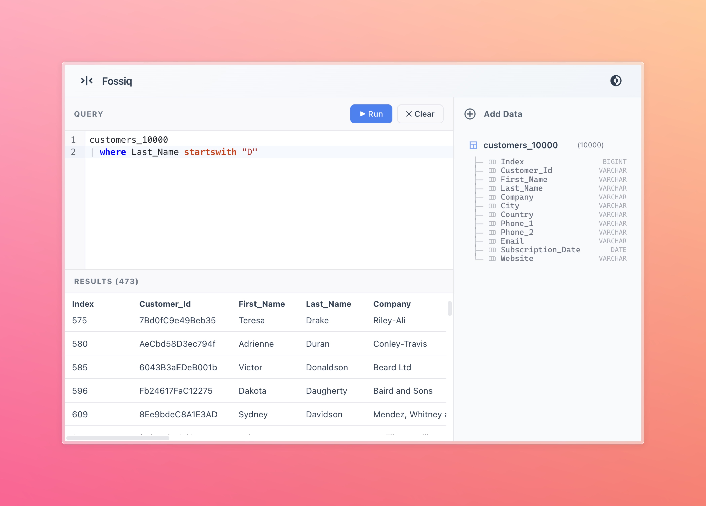

# @fossiq/ui

A modern, browser-based UI for querying your local data using Kusto Query Language (KQL), built with SolidJS and DuckDB WASM.

## Screenshot



_Fossiq UI showing the KQL editor, results table, and schema sidebar._

## Features

**Advanced KQL Editor**

The editor is powered by CodeMirror 6 and provides:

- Syntax highlighting for KQL
- Context-aware autocomplete
- Real-time syntax error visualization
- Semantic validation (e.g., checking if tables exist in the current schema)

**Local Execution**

Runs entirely in the browser using [DuckDB WASM](https://duckdb.org/docs/api/wasm/overview.html). No backend server required.

**KQL to SQL Translation**

Seamlessly translates KQL queries to DuckDB-compatible SQL on the fly using `@fossiq/kql-to-duckdb`.

**Data Visualization**

Interactive results table for exploring query results, with sorting and virtualization support.

**Modern Stack**

Built with [SolidJS](https://www.solidjs.com/) for high performance, [PicoCSS](https://picocss.com/) for a clean, minimal design, and [TanStack Table](https://tanstack.com/table) for powerful data grid functionality.

## Getting Started

To start the development server:

```bash
cd packages/ui
bun run dev
```

Visit `http://localhost:5173` (or the port shown in the console) to see the application.

## Architecture

The UI integrates several internal packages:

- **@fossiq/kql-parser**: Parses KQL queries into an AST.
- **@fossiq/kql-lezer**: Provides Lezer grammar for CodeMirror syntax highlighting and error detection.
- **@fossiq/kql-to-duckdb**: Translates KQL AST into SQL.

## License

MIT
